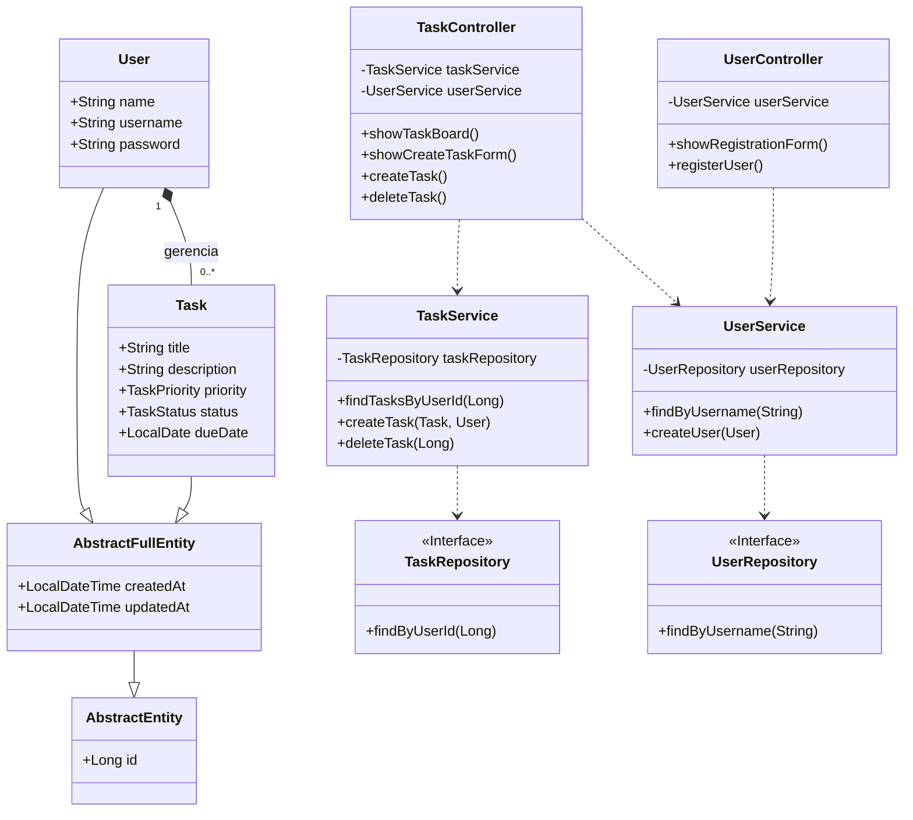
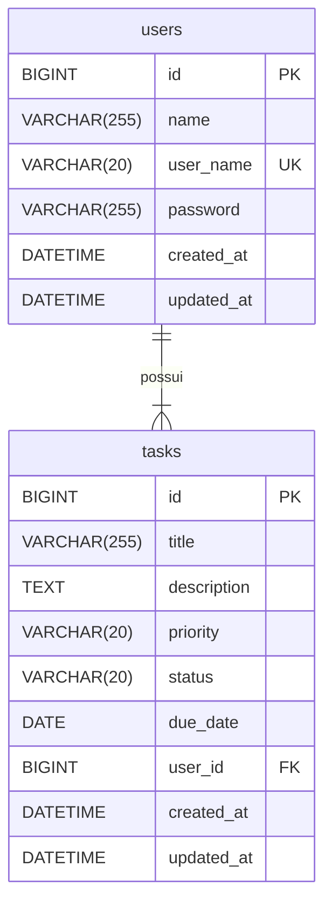

# 💻 Task Board - Desafio de Projeto Santander | DIO

<p align="center">
  
  
  
</p>

<p align="center">
  <a href="https://github.com/dougluciano2/bootcamp-dio-santander-lista-tarefas-java/actions/workflows/ci.yml">
    
  </a>
</p>


**Desenvolvido por:** [dougluciano2](https://github.com/dougluciano2)

## 📫 Como me encontrar

[](https://www.linkedin.com/in/douglasluciano/)
[](https://github.com/douglasluciano)
[](https://dougluciano2.github.io)

## 🚀 Sobre o Projeto

Esta aplicação é a solução para o desafio **"Criando seu board de tarefas com Java"**, parte da trilha **"Integração Java com Banco de dados"** do bootcamp Santander | DIO. O projeto consiste em um "Board de Tarefas" Full-Stack onde usuários podem se registrar e gerenciar suas atividades através de um CRUD completo e seguro.

Foi desenvolvido com um stack moderno baseado em Java e Spring, com ênfase em práticas de código limpo, segurança e uma infraestrutura totalmente containerizada com Docker.

## ✨ Funcionalidades

-   [✔] **Gerenciamento de Usuários:** Cadastro e autenticação segura de usuários.
-   [✔] **Segurança:** Sistema de Login/Logout com Spring Security, com senhas criptografadas usando BCrypt.
-   [✔] **CRUD de Tarefas:**
    -   Criação de novas tarefas com título, descrição, status, prioridade e data de vencimento.
    -   Visualização de todas as tarefas associadas ao usuário logado.
    -   Edição de tarefas existentes.
    -   Exclusão de tarefas com confirmação.
-   [✔] **Interface Web:** Interface de usuário reativa construída com Thymeleaf e estilizada com Bootstrap 5.
-   **Infraestrutura como Código:**
    -   Banco de dados MySQL containerizado com Docker.
    -   Migrations de banco de dados gerenciadas pelo Flyway.
    -   Dockerfile multi-estágio para uma imagem de produção otimizada.
    -   Orquestração completa da aplicação e do banco com Docker Compose.
-   [✔] **CI/CD:** Workflow de Integração Contínua com GitHub Actions para garantir a qualidade do código a cada commit.

## 🛠️ Tecnologias Utilizadas

A tabela abaixo lista as principais tecnologias e frameworks usados na construção do projeto:

| Categoria | Tecnologia |
| :--- | :--- |
| **Backend** |     |
| **Frontend** |   |
| **Banco de Dados** |   |
| **Build & Ferramentas** |   |
| **DevOps & Infra** |   |

## 🗺️ Diagrama de Classes


## 💾 Diagrama de Entidade-Relacionamento (ERD)

O diagrama abaixo representa a estrutura do banco de dados da aplicação, incluindo as tabelas `users` e `tasks` e o relacionamento entre elas.



## 🏁 Como Executar

Existem duas maneiras de executar este projeto: em modo de desenvolvimento (via IDE) ou como uma aplicação containerizada (via Docker Compose).

### 1. Modo de Desenvolvimento (IDE + Docker)

**Pré-requisitos:**
* JDK 21
* Maven
* Docker Desktop ou CLI

**Passos:**
1.  Clone o repositório: `git clone https://github.com/dougluciano2/bootcamp-dio-santander-lista-tarefas-java.git`
2.  Abra o projeto na sua IDE de preferência (IntelliJ, VS Code, etc.).
3.  Garanta que o Docker Desktop esteja em execução.
4.  Execute a classe principal `BoadtaskjavaApplication.java`.

A dependência `spring-boot-docker-compose` irá detectar o arquivo `compose.dev.yml` e iniciará automaticamente o contêiner do banco de dados MySQL para a aplicação. A aplicação estará acessível em `http://localhost:8080`.

### 2. Modo Standalone (Docker Compose)
Este modo simula um ambiente de "produção", empacotando a aplicação em uma imagem Docker e orquestrando tudo com um único comando.

**Pré-requisitos:**
* Docker e Docker Compose

**Passos:**
1.  Clone o repositório.
2.  Abra um terminal na raiz do projeto.
3.  Execute o seguinte comando:
    ```bash
    docker compose up --build
    ```
4.  Aguarde o Docker construir a imagem da aplicação e iniciar os contêineres do app e do banco de dados.
5.  Acesse a aplicação no seu navegador em **[http://localhost:8080](http://localhost:8080)**.

Para parar a aplicação, pressione `Ctrl + C` no terminal e execute `docker compose down`.
